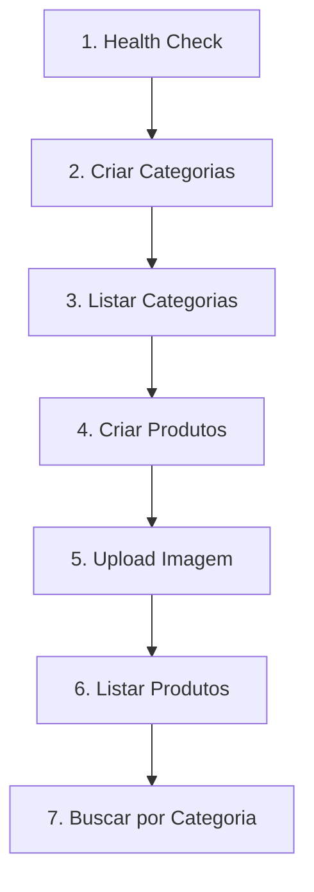

# 📚 EconAgro API - Guia do Postman

Este guia explica como usar a documentação da API EconAgro no Postman.

## 🚀 Importando a Coleção

### 1. **Importar no Postman**
1. Abra o Postman
2. Clique em **Import** (botão no canto superior esquerdo)
3. Selecione o arquivo `EconAgro_API_Postman_Collection.json`
4. Clique em **Import**

### 2. **Configurar Variáveis de Ambiente**
1. Crie um novo Environment no Postman
2. Nome: `EconAgro Local`
3. Adicione as seguintes variáveis:

| Variável | Valor | Descrição |
|----------|-------|-----------|
| `baseUrl` | `http://localhost:3001/api` | URL base da API |

## 📁 Estrutura da Coleção

A coleção está organizada em 3 pastas principais:

### **🏥 Health**
- `GET /health` - Verifica status da API

### **📂 Categories** 
- `GET /categories` - Lista todas as categorias
- `POST /categories` - Cria nova categoria
- `GET /categories/:id` - Busca categoria por ID
- `PUT /categories/:id` - Atualiza categoria
- `DELETE /categories/:id` - Remove categoria

### **🍎 Products**
- `GET /products` - Lista todos os produtos
- `POST /products` - Cria produto (com upload de imagem)
- `GET /products/:id` - Busca produto por ID
- `PUT /products/:id` - Atualiza produto (com upload de imagem)
- `DELETE /products/:id` - Remove produto
- `GET /products/category/:categoryName` - Busca por categoria

## 🎯 Como Usar

### **1. Testando a API**

#### **Primeiro, teste a conexão:**
```
GET {{baseUrl}}/health
```
✅ Deve retornar: `{"status": "API está funcionando"}`

#### **Criar uma categoria:**
```
POST {{baseUrl}}/categories
Content-Type: application/json

{
  "name": "Frutas",
  "description": "Frutas frescas e sazonais"
}
```

### **2. Upload de Imagens (Produtos)**

**⚠️ IMPORTANTE:** Rotas de produtos (`POST` e `PUT`) usam **FormData**, não JSON.

#### **Criando produto com imagem:**

1. Selecione `POST {{baseUrl}}/products`
2. Vá para a aba **Body** 
3. Selecione **form-data**
4. Adicione os campos:

| Key | Type | Value | Obrigatório |
|-----|------|-------|-------------|
| `name` | Text | `Maçã Gala` | ✅ |
| `description` | Text | `Maçãs frescas` | ❌ |
| `price` | Text | `4.99` | ✅ |
| `quantity` | Text | `100` | ❌ |
| `category` | Text | `ID_DA_CATEGORIA` | ✅ |
| `image` | File | *selecionar arquivo* | ❌ |

### **3. Fluxo de Teste Recomendado**



#### **Sequência de testes:**

1. **Health Check**
   ```
   GET /health
   ```

2. **Criar categorias base**
   ```
   POST /categories
   {"name": "Frutas", "description": "Frutas frescas"}
   
   POST /categories  
   {"name": "Grãos", "description": "Cereais e leguminosas"}
   ```

3. **Listar categorias** (copie os IDs)
   ```
   GET /categories
   ```

4. **Criar produto com imagem**
   ```
   POST /products (FormData)
   - name: Banana Prata
   - price: 3.50
   - category: [ID da categoria Frutas]
   - image: [arquivo de imagem]
   ```

5. **Testar busca por categoria**
   ```
   GET /products/category/Frutas
   ```

## 📝 Validações Importantes

### **Produtos:**
- **Nome**: 3-100 caracteres (obrigatório)
- **Preço**: número > 0 (obrigatório)
- **Categoria**: ObjectId válido (obrigatório)
- **Imagem**: máx 5MB, formatos: jpg, jpeg, png, webp

### **Categorias:**
- **Nome**: único e obrigatório
- **Descrição**: opcional

## ❗ Troubleshooting

### **Erro 400 - Bad Request**
- Verifique se todos os campos obrigatórios foram preenchidos
- Para produtos, certifique-se de usar FormData, não JSON

### **Erro 404 - Not Found**
- Verifique se a URL está correta
- Confirme se o servidor está rodando na porta 3001

### **Erro 422 - Validation Error**
- Verifique se o ObjectId da categoria é válido
- Confirme se o preço é um número positivo

### **Erro de Upload**
- Tamanho máximo: 5MB
- Formatos aceitos: jpg, jpeg, png, webp
- Certifique-se de selecionar "File" no tipo do campo

## 🔧 Configuração do Backend

Antes de usar a API, certifique-se de que:

1. **MongoDB** está rodando e conectado
2. **Cloudinary** está configurado no `.env`:
   ```env
   CLOUDINARY_CLOUD_NAME=seu_cloud_name
   CLOUDINARY_API_KEY=sua_api_key
   CLOUDINARY_API_SECRET=seu_api_secret
   ```
3. **Servidor** está rodando na porta 3001:
   ```bash
   npm run dev
   ```

## 📚 Exemplos de Resposta

### **Sucesso - Produto Criado:**
```json
{
  "success": true,
  "data": {
    "id": "648f8a2b9c123456789012ij",
    "name": "Banana Prata",
    "description": "Bananas prata maduras e doces",
    "price": 3.5,
    "quantity": 50,
    "category": "648f8a2b9c123456789012ab",
    "img": "https://res.cloudinary.com/seu_cloud/image/upload/v1234567890/econagro/products/product_1234567890_987654321.jpg",
    "active": true,
    "createdAt": "2023-06-18T11:15:00.000Z",
    "updatedAt": "2023-06-18T11:15:00.000Z"
  }
}
```

### **Erro - Validação:**
```json
{
  "success": false,
  "message": "Erro de validação",
  "errors": [
    {
      "field": "name",
      "message": "O nome é obrigatório"
    }
  ]
}
```

---

## 🎉 Pronto para Usar!

Agora você tem uma documentação completa da API EconAgro no Postman. Use este guia para testar todas as funcionalidades da API, incluindo upload de imagens para o Cloudinary.

**💡 Dica:** Salve as respostas de criação de categorias para usar os IDs nos testes de produtos!
